# Guía de uso de SERA

SERA permite gestionar las membresías, los pagos, las reservas y los ingresos al Polideportivo de la UNSE. Esta guía explica el uso de la aplicación para usuarios, administración y personal de accesos.

Las capturas muestran cuentas y operaciones ficticias de la demo local. Los nombres, importes, fechas y horarios pueden cambiar en otra instalación. Seguí las etiquetas de los controles y el estado que muestra tu propia cuenta.

Para instalar o iniciar el sistema, consultá la [guía de instalación y presentación](INSTALACION_SERA.docx). Este documento se concentra en las operaciones que se realizan desde el navegador.

## Índice

- [1. Acceso y navegación](#1-acceso-y-navegación)
- [2. Perfil y carnet](#2-perfil-y-carnet)
- [3. Membresías: contratar, pagar, renovar y cancelar](#3-membresías-contratar-pagar-renovar-y-cancelar)
- [4. Reservas, pagos y tickets](#4-reservas-pagos-y-tickets)
- [5. Encuestas para usuarios](#5-encuestas-para-usuarios)
- [6. Administración de usuarios y socios](#6-administración-de-usuarios-y-socios)
- [7. Niveles, espacios, horarios y tarifas](#7-niveles-espacios-horarios-y-tarifas)
- [8. Administración de pagos y reservas](#8-administración-de-pagos-y-reservas)
- [9. Informes y exportación](#9-informes-y-exportación)
- [10. Administración de encuestas](#10-administración-de-encuestas)
- [11. Control de accesos](#11-control-de-accesos)
- [12. Problemas frecuentes](#12-problemas-frecuentes)
- [13. Recorrido de demostración](#13-recorrido-de-demostración)

## 1. Acceso y navegación

### Qué puede hacer cada rol

| Rol | Operaciones principales |
| --- | --- |
| Usuario | Actualizar su perfil, consultar su carnet, contratar y cancelar membresías, consultar pagos, reservar espacios, utilizar tickets y responder encuestas. |
| Administrador | Gestionar usuarios, socios, niveles, espacios y tarifas; confirmar efectivo; consultar reservas; generar informes; publicar encuestas y ver sus resultados. También puede validar ingresos. |
| Personal de accesos | Leer códigos de carnet o reserva, consultar su vigencia y confirmar el ingreso a una reserva. |

El registro público crea una cuenta de usuario. Los roles de administración y personal se asignan desde la gestión de usuarios.

### Iniciar sesión

1. Abrí la dirección de SERA que te indique la administración. En la demo local es `http://localhost:5173`.
2. Escribí tu **Email** y **Contraseña**.
3. Elegí **Iniciar sesión**.
4. Esperá a que aparezca tu pantalla de inicio. Las opciones del menú dependen de tu rol.

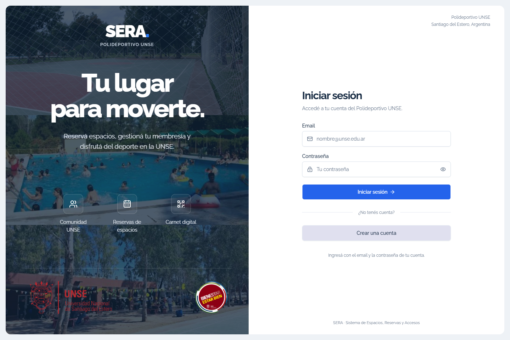

*Figura 1. Acceso con email y contraseña. El ícono del ojo permite revisar la contraseña antes de enviarla.*

### Crear una cuenta

1. Desde el acceso, elegí **Crear una cuenta**.
2. Completá el nombre, apellido, DNI, email, contraseña y confirmación que pide el formulario.
3. Indicá tu relación declarada con la UNSE y el identificador correspondiente, si aplica.
4. Enviá el formulario. Si aparece un error, corregí el campo indicado y volvé a enviarlo.

La contraseña debe tener al menos ocho caracteres. La relación declarada con la UNSE queda pendiente de verificación administrativa: declararte estudiante no habilita automáticamente la tarifa de estudiante.

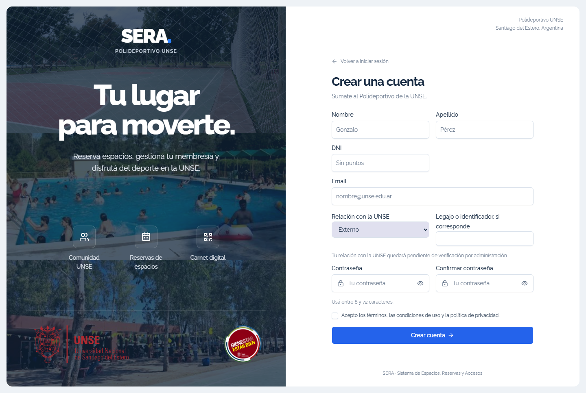

*Figura 2. Registro de una cuenta de usuario. No necesitás contratar una membresía para crear la cuenta.*

### Moverse por la aplicación

En una computadora, usá el menú lateral. En el teléfono, usá la barra inferior y **Más** para acceder al resto de las opciones. **Mi membresía** muestra el estado de la contratación. Si todavía no contrataste, permite abrir el catálogo de niveles; después de cancelar, muestra el enlace para volver a contratar. **Mis pagos** reúne cobros de membresías y reservas.

Para salir, elegí el botón **Cerrar sesión**, identificado con el ícono de salida. Si SERA te devuelve al acceso porque la sesión terminó, ingresá otra vez con tu cuenta.

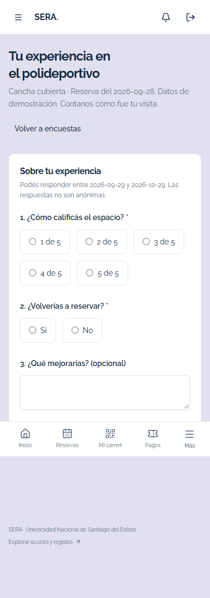

*Figura 3. Navegación móvil. El menú Más permite abrir secciones que no aparecen en la barra inferior.*

## 2. Perfil y carnet

### Actualizar tus datos

Desde **Inicio**, elegí **Ir a mi perfil**, revisá el nombre completo, email y DNI, y elegí **Guardar cambios** después de modificarlos. Esperá el mensaje de confirmación antes de salir de la pantalla.

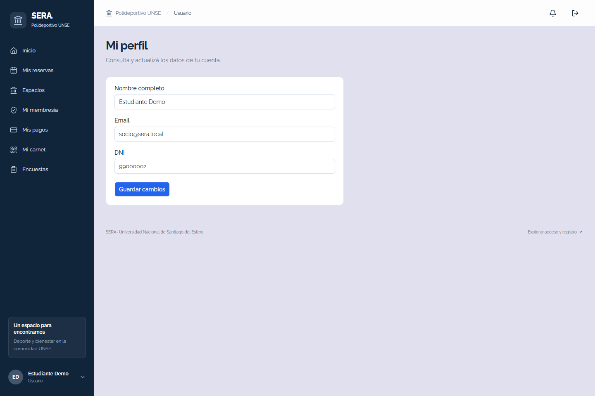

*Figura 4. Los datos del perfil corresponden a la cuenta que inició sesión.*

El perfil no permite cambiar el rol ni aprobar la relación con la UNSE. Si necesitás corregir esa verificación o recuperar el acceso a tu cuenta, contactá a administración.

### Presentar el carnet

Abrí **Mi carnet** para mostrar el QR personal al personal de accesos. El QR identifica tu cuenta; SERA consulta tu situación actual cuando se lo valida. Una captura antigua del carnet no conserva beneficios después de cancelar o vencer la membresía.

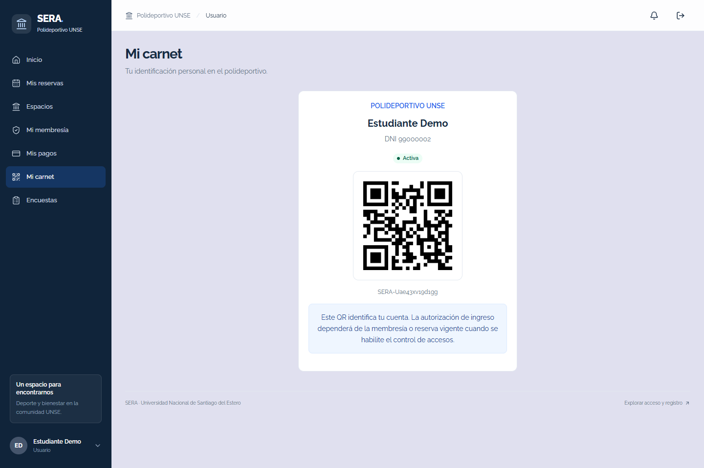

*Figura 5. El carnet personal y el QR de una reserva tienen usos diferentes.*

El carnet permite comprobar la vigencia de los beneficios de membresía. Para ingresar a una reserva, mostrale al personal el QR o código de esa reserva desde **Mis reservas**.

## 3. Membresías: contratar, pagar, renovar y cancelar

### Elegir un nivel y contratar

1. Abrí **Mi membresía** y elegí **Ver niveles disponibles**. Desde Inicio también podés elegir **Consultar niveles** si todavía no contrataste.
2. Revisá los beneficios y el precio mensual de cada nivel.
3. En **Cómo querés pagar**, elegí Mercado Pago o efectivo.
4. Elegí **Solicitar membresía** en el nivel deseado.
5. Revisá la confirmación y continuá con el medio elegido.

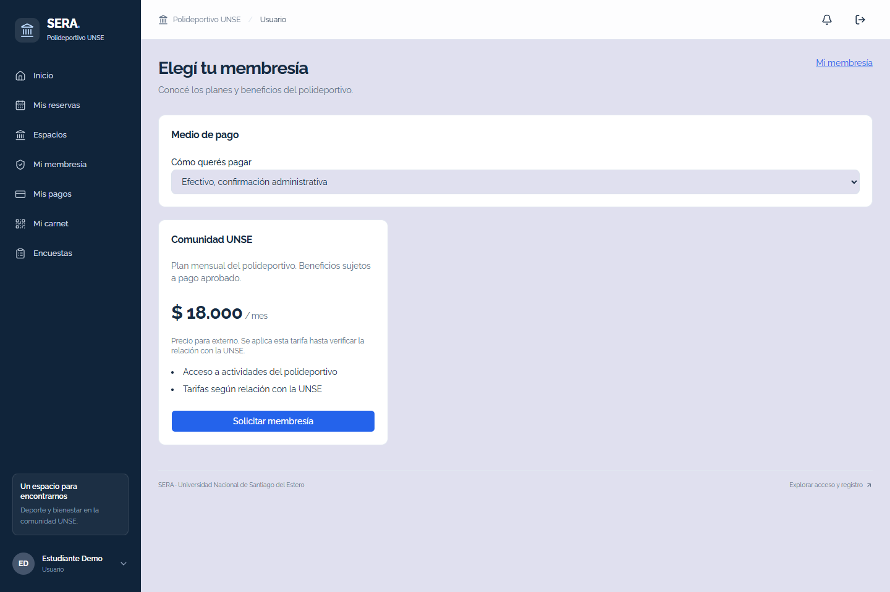

*Figura 6. SERA muestra la tarifa que corresponde a la relación UNSE verificada. Mientras la verificación esté pendiente o rechazada, aplica la tarifa de externo.*

La solicitud queda **Pendiente pago**. Los beneficios se habilitan cuando se aprueba la primera cuota. Si ya tenés una membresía activa, pendiente, vencida o suspendida, consultá **Mi membresía** para continuar el trámite correspondiente.

### Pagar en efectivo

La contratación genera un pago pendiente en efectivo. Acercate a administración para abonarlo e indicá qué membresía estás pagando. El administrador registra la recepción desde **Pagos → Confirmar efectivo**.

Después, abrí **Mi membresía** y elegí **Actualizar estado**. Cuando se confirme el cobro, verás **Activa** y la fecha **Vence el**. En **Mis pagos**, el pago aprobado permite consultar su comprobante y la vigencia resultante.

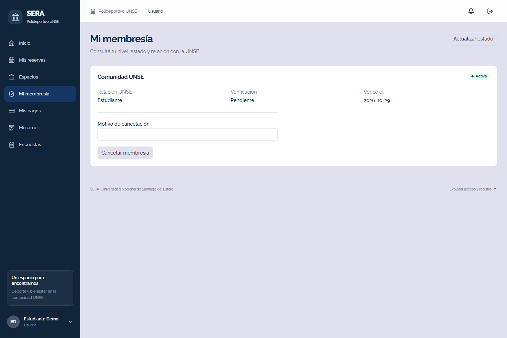

*Figura 7. El estado de la membresía y su próximo vencimiento se consultan en Mi membresía.*

### Pagar con Mercado Pago

Para membresías, Mercado Pago autoriza una suscripción con cobro mensual.

1. Al confirmar la solicitud, SERA abre el enlace de Mercado Pago.
2. Completá la autorización en el proveedor.
3. Volvé a SERA y abrí **Mi membresía**.
4. Si el estado todavía no se actualizó, elegí **Ya pagué, verificar pago**.
5. Si Mercado Pago aún no informó el cobro, esperá y volvé a verificar.

Volver del proveedor no confirma por sí solo el pago. La membresía se activa después de que SERA verifica el cobro aprobado. La verificación también está disponible para membresías activas o vencidas con una suscripción de Mercado Pago, aunque no aparezca otro pago pendiente en el historial.

Si cerraste el checkout antes de autorizar, podés retomar desde **Continuar a Mercado Pago** cuando esa opción esté disponible. Si la solicitud quedó registrada pero hubo un error al abrir Mercado Pago, continuá desde **Mi membresía**; evitá crear otra solicitud para el mismo trámite.

Si SERA indica que la operación tiene un **resultado incierto**, contactá a administración para revisar la suscripción. Si indica que la suscripción está cancelada, cancelá la solicitud local y volvé a contratar. La configuración del proveedor corresponde a administración; se documenta en [MERCADO_PAGO.md](MERCADO_PAGO.md).

### Consultar los pagos y renovar

En **Mis pagos**, usá el filtro **Estado** y los botones **Anterior** y **Siguiente**. Elegí **Ver** para abrir el detalle de un pago. **Actualizar** refresca los cobros y la información de membresía.

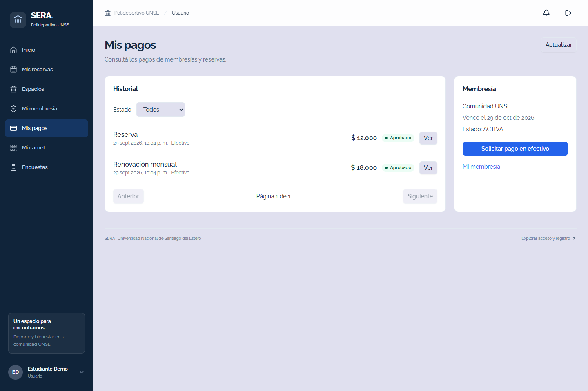

*Figura 8. El historial puede contener pagos aprobados, pendientes y cancelados de contrataciones anteriores.*

Para renovar una membresía en efectivo, elegí **Solicitar pago en efectivo** cuando esté disponible y aboná en administración. SERA no ofrece otro pago en efectivo si ya hay un pendiente o una suscripción mensual de Mercado Pago. Si usás Mercado Pago, verificá los cobros desde **Mi membresía**.

Una renovación aprobada extiende un mes desde el vencimiento actual si todavía está en el futuro. Si la membresía ya venció, el plazo se cuenta desde la fecha del nuevo cobro. El día indicado en **Vence el** ya no hay beneficios vigentes. Repetir la confirmación o verificación de un mismo pago no agrega otro mes.

| Estado | Qué significa | Cómo continuar |
| --- | --- | --- |
| Pendiente pago | Se solicitó el nivel, pero no se aprobó la primera cuota. | Completar el pago, esperar la confirmación de efectivo o verificar Mercado Pago. |
| Activa | Tiene una cuota aplicada y un vencimiento futuro. | Usar sus beneficios y renovar por el medio correspondiente. |
| Vencida | Se alcanzó el próximo vencimiento. | Renovar en efectivo o verificar el cobro mensual de Mercado Pago. |
| Suspendida | Administración suspendió los beneficios. | Contactar a administración. Un nuevo cobro no levanta la suspensión. |
| Cancelada | La contratación terminó y sus beneficios se retiraron. | Consultar niveles y volver a contratar si lo deseás. |

Las solicitudes pendientes sin una suscripción vigente pueden cancelarse por vencimiento: un proceso horario revisa los pagos pendientes de más de una hora. Revisá el estado antes de intentar completar una solicitud antigua.

### Cancelar y volver a contratar

1. Abrí **Mi membresía**.
2. Escribí el **Motivo de cancelación**.
3. Elegí **Cancelar membresía** y luego **Confirmar cancelación**.
4. Esperá el mensaje **La membresía fue cancelada**.
5. Si querés contratar otra vez, elegí **Consultar niveles y volver a contratar**.
6. Elegí el nuevo nivel y medio, y completá un nuevo pago.

La cancelación retira los beneficios de inmediato y conserva el historial de cobros aprobados. Los pagos pendientes de la contratación se cancelan. Para Mercado Pago, SERA primero debe confirmar la baja de la suscripción remota; si el proveedor falla, la pantalla muestra el error y la cancelación local no se completa.

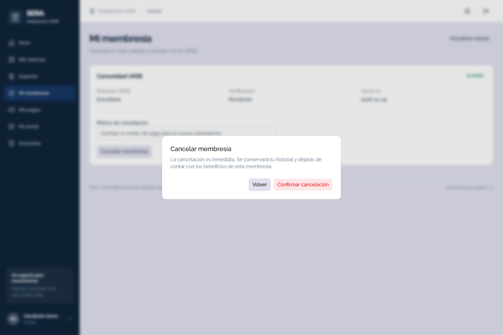

*Figura 9. La confirmación explica que la cancelación retira los beneficios y conserva el historial.*

La nueva contratación empieza pendiente de pago y sin vigencia anterior. Un cobro tardío de la suscripción vieja no activa la nueva membresía: queda para revisión administrativa. Cancelar una membresía no tramita una devolución automática del dinero ya abonado.

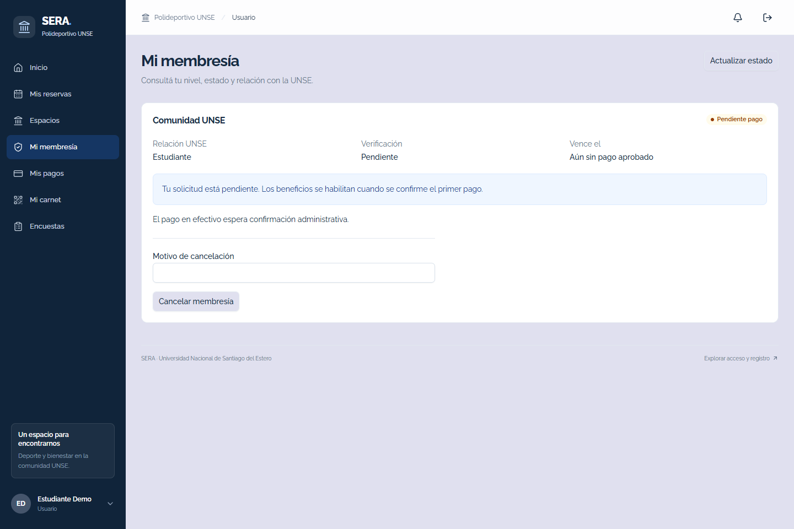

*Figura 10. La nueva solicitud requiere aprobar otra cuota. La fecha de la contratación cancelada no se reutiliza.*

## 4. Reservas, pagos y tickets

### Consultar un espacio

Abrí **Espacios**, buscá el lugar y elegí **Consultar disponibilidad**. Revisá capacidad, tarifas y horarios para la fecha deseada. Una cuenta activa puede reservar; el modelo actual no exige una membresía activa para todas las reservas.

### Crear una reserva

1. Desde el espacio o **Mis reservas**, iniciá una nueva reserva.
2. Elegí **Espacio**, **Fecha**, **Duración** y **Horario disponible**.
3. Indicá la **Cantidad de personas**, dentro de la capacidad del lugar.
4. Elegí el **Medio de pago**. Si tenés un ticket con saldo, podés seleccionarlo.
5. Revisá el resumen de tarifa, total, ticket aplicado e importe restante.
6. Elegí **Revisar reserva**.
7. Comprobá los datos y elegí **Crear reserva**. Usá **Modificar** si necesitás corregir algo antes de enviarla.

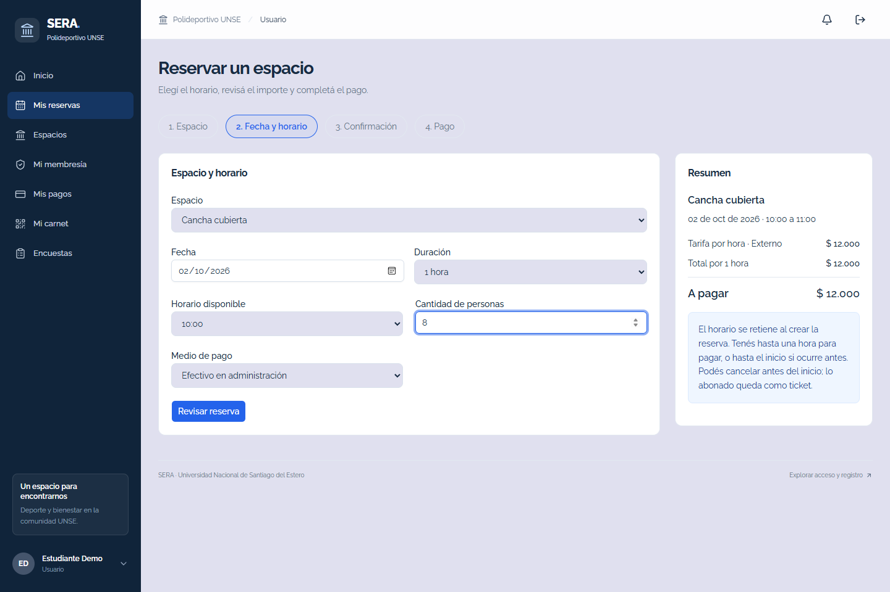

*Figura 11. Los horarios ofrecidos descuentan las reservas y bloqueos existentes.*

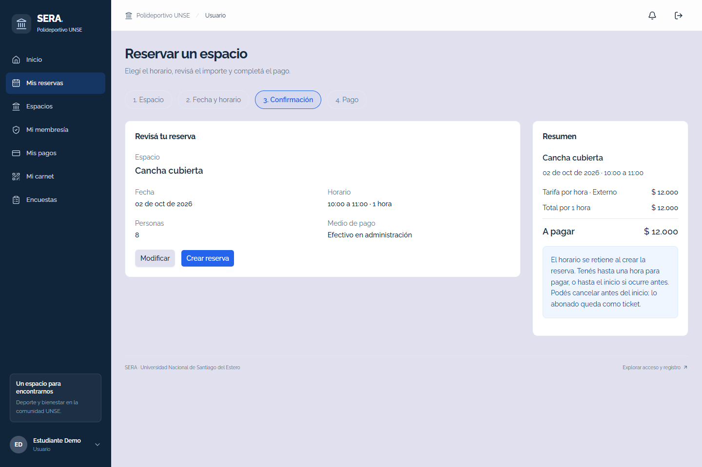

*Figura 12. Revisá espacio, fecha, horario, personas e importe antes de crear la reserva.*

Las duraciones disponibles son de una a cuatro horas completas. Los horarios corresponden a Argentina y no pueden cruzar medianoche. Si un horario deja de estar disponible mientras completás la solicitud, elegí otro: SERA comprueba la disponibilidad nuevamente al guardar.

### Confirmar el pago de la reserva

Una reserva con importe pendiente retiene el horario por un plazo limitado: hasta una hora, o hasta el inicio de la reserva si ocurre antes.

- **Efectivo:** administración debe registrar el cobro en **Pagos** antes del vencimiento.
- **Mercado Pago:** completá el checkout de la reserva y volvé a su detalle. Si hace falta, usá la verificación del número de pago que aparece en esa pantalla.
- **Ticket que cubre todo el importe:** la reserva puede confirmarse sin un nuevo cobro. Si el ticket cubre solo una parte, se paga la diferencia.

La reserva genera su código y QR después de confirmarse. Volver del checkout con un mensaje de aprobación no reemplaza la verificación del cobro en SERA.

### Mostrar el QR y consultar el estado

Abrí **Mis reservas → Ver detalle** para consultar fecha, horario, personas, estado y pago. Mostrá el QR de una reserva confirmada al personal cuando corresponda ingresar.

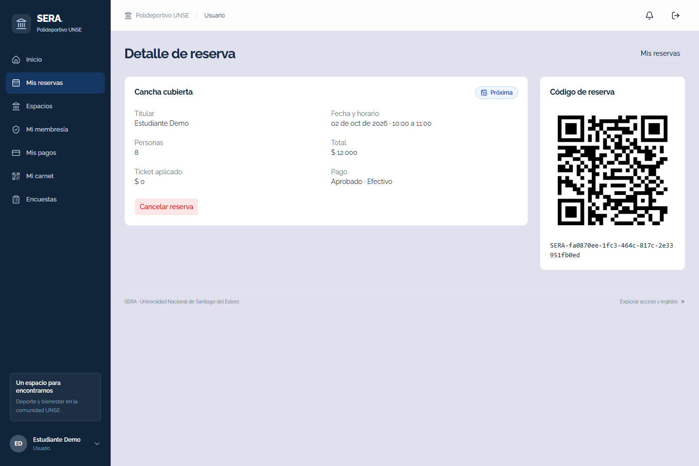

*Figura 13. El QR identifica una reserva concreta. Su vigencia depende del día, horario y registro de ingreso.*

| Estado visible | Significado |
| --- | --- |
| Pendiente de pago | Espera el pago o su confirmación. |
| Próxima | Está confirmada y su horario todavía no comenzó. |
| En curso ahora | Está dentro del horario reservado. |
| Consumida | El personal confirmó el ingreso. |
| Finalizada sin ingreso | Terminó el horario y no se registró ingreso. |
| Cancelada o vencida | El horario se liberó y el código no permite ingresar. |

### Cancelar una reserva y reutilizar su ticket

1. Abrí el detalle de la reserva antes de su inicio.
2. Elegí **Cancelar reserva** y confirmá la acción.
3. Si estaba pagada, revisá el **Saldo de ticket**.
4. En una nueva reserva, elegí ese ticket en **Ticket de una cancelación** o usá el enlace para reservar con su saldo.
5. Revisá la diferencia a pagar antes de confirmar.

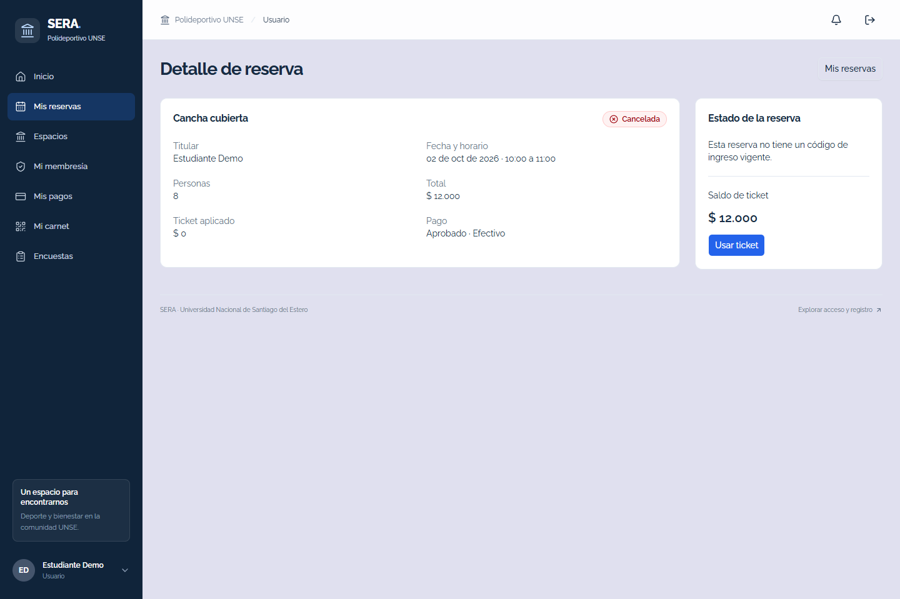

*Figura 14. El ticket conserva saldo para otra reserva; no representa un reintegro automático de dinero.*

Después del inicio no se permite cancelar. Si la reserva no se había pagado, no genera saldo por ese importe. Si usaste un ticket y la nueva reserva pendiente se cancela o vence, el saldo aplicado vuelve al ticket de origen. Se admite un ticket por reserva y el sobrante se conserva.

## 5. Encuestas para usuarios

Las encuestas aparecen después de que el personal registra el ingreso a una reserva. Tener una reserva confirmada o haber alcanzado su hora de finalización no equivale a haber registrado ese ingreso.

1. Abrí **Encuestas**.
2. Buscá una encuesta **Disponible** y elegí **Responder encuesta**.
3. Revisá la reserva y el período de respuesta que muestra el encabezado.
4. Completá las preguntas marcadas con asterisco. Las demás son opcionales.
5. Elegí **Enviar encuesta**.
6. Esperá **Tu respuesta quedó registrada**. Podés volver a consultarla después.

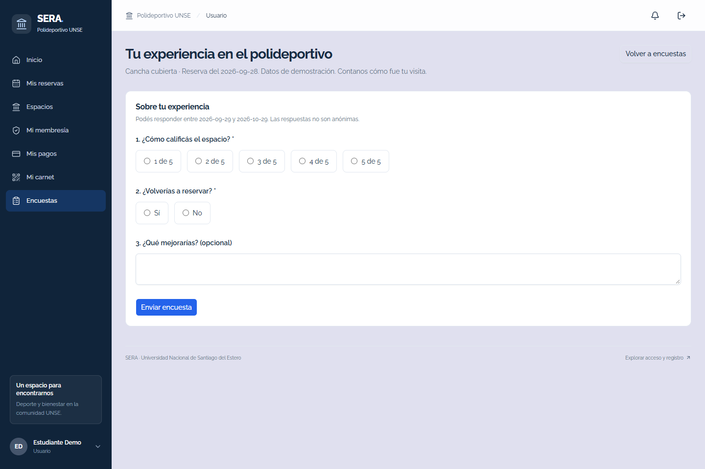

*Figura 15. Una encuesta puede combinar calificación de uno a cinco, elección de opción y texto libre.*

Se admite una respuesta por encuesta y reserva. Las respuestas enviadas no se editan. Las encuestas no son anónimas: administración puede consultar la respuesta y la reserva asociada. Cuando una encuesta está cerrada o fuera de su período, podés consultar el estado, pero no enviar una nueva respuesta.

## 6. Administración de usuarios y socios

### Gestionar cuentas

Abrí **Usuarios**, buscá por los datos de la persona y abrí el registro para consultar o modificar sus datos. Desde esta sección se crean cuentas, se asigna el rol, se actualiza el estado de cuenta y se cambia la contraseña cuando corresponde.

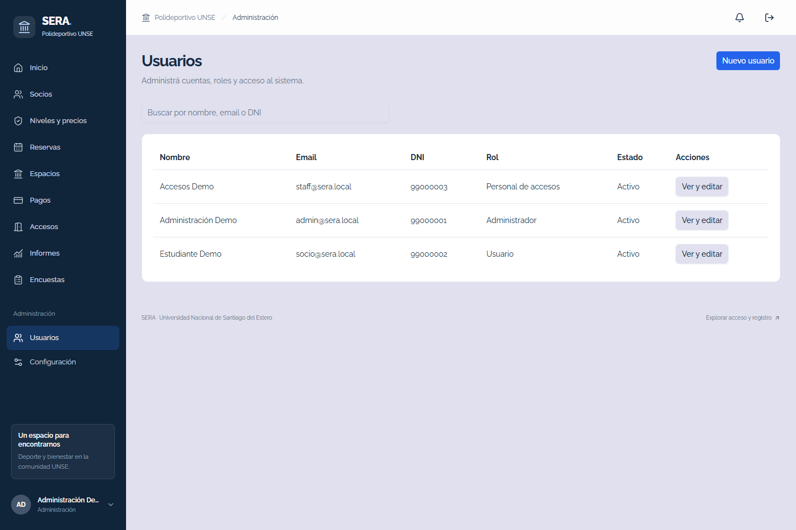

*Figura 16. La cuenta, su rol y su estado se administran desde Usuarios.*

Revisá la identidad y el rol antes de guardar. Inactivar una cuenta no borra sus registros históricos. Una cuenta inactiva o deshabilitada no debe usarse para nuevas contrataciones o ingresos.

### Verificar la relación UNSE y gestionar membresías

1. Abrí **Socios**.
2. Buscá a la persona. Podés filtrar por estado de membresía o relación UNSE.
3. Abrí la edición del registro.
4. Contrastá la documentación y actualizá la relación, su verificación y el identificador correspondiente.
5. Si modificás el estado de membresía, elegí una transición válida.
6. Completá el motivo y guardá los cambios. Consultá el historial de cambios para revisar las intervenciones anteriores.

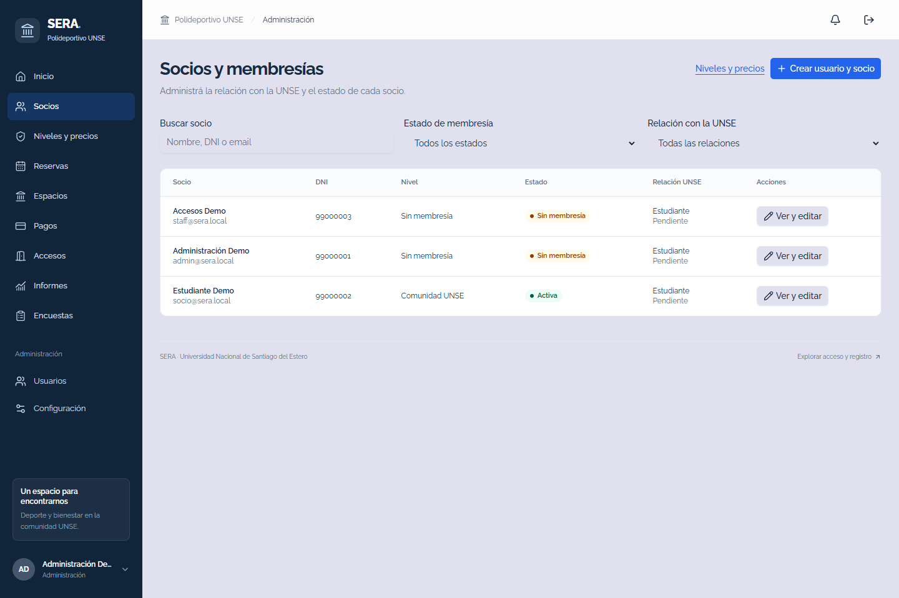

*Figura 17. La verificación administrativa determina qué tarifa UNSE puede aplicarse.*

Una membresía pendiente no puede activarse mediante una edición administrativa: requiere un pago aprobado. Para cambiar el nivel de una solicitud pendiente, cancelala y volvé a contratar. Si usa Mercado Pago, cancelá la suscripción antes de cambiar de nivel. El nuevo cobro no levanta una suspensión administrativa.

## 7. Niveles, espacios, horarios y tarifas

### Configurar niveles de membresía

En **Niveles y precios**, creá o editá el nombre, descripción, beneficios y precios mensuales por relación UNSE. Indicá si el nivel está disponible para nuevas contrataciones y guardá.

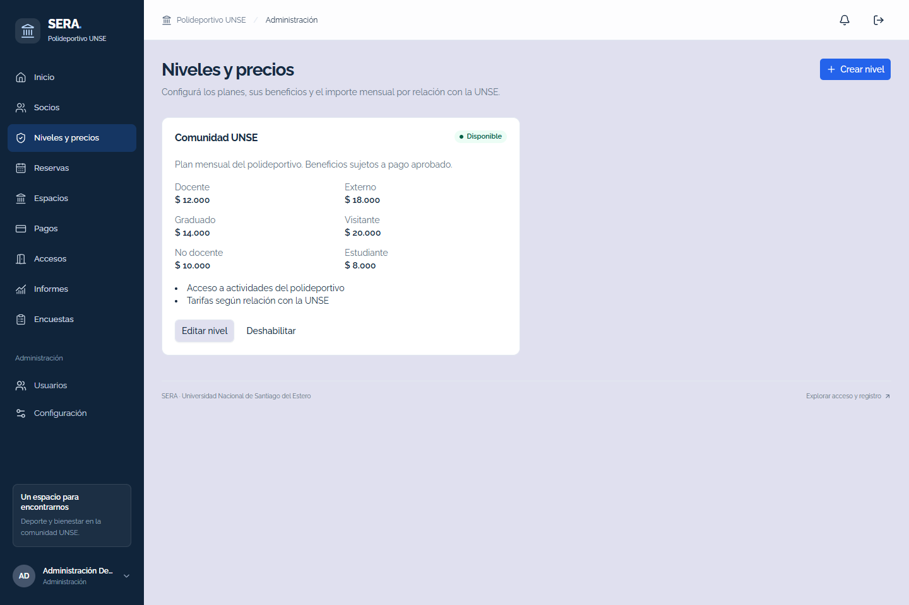

*Figura 18. Los precios de membresía son mensuales; las tarifas de espacios son por hora.*

Deshabilitar un nivel lo retira de las nuevas contrataciones. No altera automáticamente el importe de una suscripción de Mercado Pago ya creada: el cambio de plan se realiza cancelando y contratando nuevamente.

### Registrar y mantener espacios

1. Abrí **Espacios** y elegí registrar un espacio.
2. Completá nombre, descripción, tipo, capacidad, tarifa general por hora e imagen, si corresponde.
3. Guardá el espacio y abrí **Administrar espacio**.
4. Configurá los **Horarios semanales** de cada día.
5. Para excepciones, elegí una fecha y agregá un **Bloqueo por fecha** con inicio, fin y motivo.
6. Revisá las **Tarifas por relación UNSE** y guardalas.

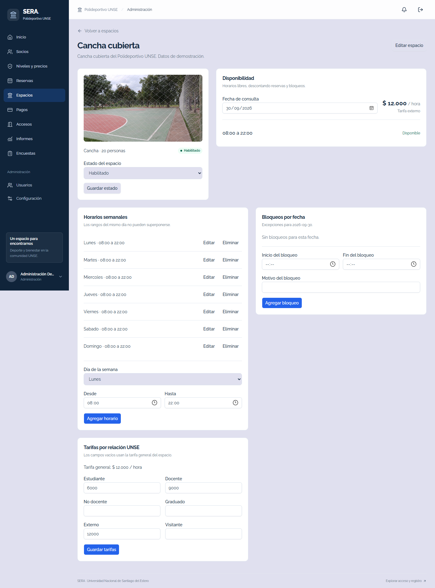

*Figura 19. La disponibilidad se calcula con horarios semanales, bloqueos y reservas existentes.*

Los rangos del mismo día no pueden superponerse. En las tarifas del espacio, un campo vacío utiliza la tarifa general. Para mantenimiento o deshabilitación, cambiá **Estado del espacio** y elegí **Guardar estado**. Si un cambio entra en conflicto con reservas existentes, SERA muestra el motivo y no lo guarda.

## 8. Administración de pagos y reservas

### Confirmar efectivo

1. Abrí **Pagos**.
2. Filtrá por **Pendiente** si querés reducir el listado.
3. Revisá titular, concepto e importe. Diferenciá una cuota mensual de una reserva o diferencia de ticket.
4. Cuando recibas el dinero, elegí **Confirmar efectivo** en esa fila.
5. Esperá **El pago en efectivo quedó confirmado**.
6. Comprobá el estado aprobado y el comprobante. La membresía o reserva asociada se actualiza con esa confirmación.

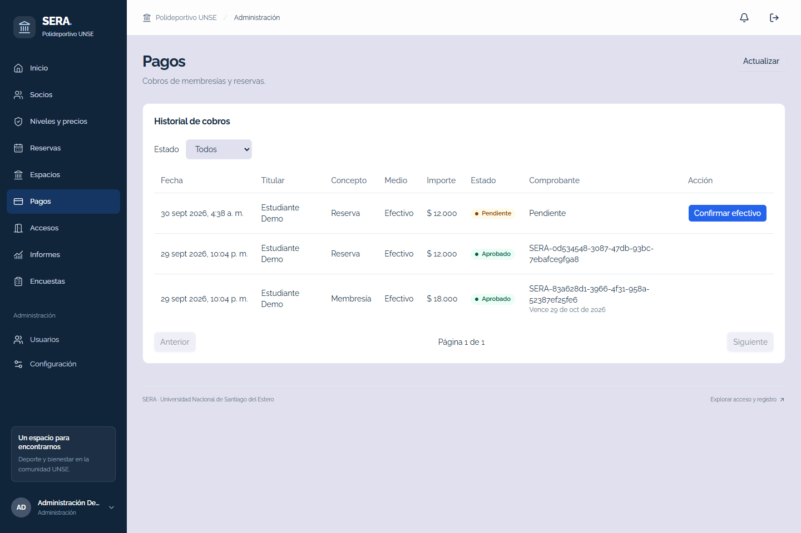

*Figura 20. La acción Confirmar efectivo se ofrece para pagos pendientes de ese medio.*

Los cobros de Mercado Pago se verifican con el proveedor. Para membresías, **Conciliar cobros** permite recuperar facturas si faltó una notificación. No uses una confirmación de efectivo para acreditar un pago de Mercado Pago.

Un pago marcado **En revisión** requiere intervención administrativa: por ejemplo, un cobro de una contratación anterior o de una reserva que ya se canceló. Un cobro aprobado en revisión no garantiza que haya activado beneficios o confirmado una reserva. Revisá el motivo en el historial y la situación correspondiente en el proveedor.

### Consultar reservas

En **Reservas**, revisá los registros y filtros disponibles. Abrí el detalle para consultar titular, espacio, fecha, horario y estado. Las acciones de cancelación y verificación respetan las mismas reglas de horario y pago que las del titular. La confirmación de ingreso se realiza desde **Accesos**.

## 9. Informes y exportación

### Generar un informe

1. Abrí **Informes**.
2. Elegí el **Tipo de informe**: socios, reservas, pagos o utilización de espacios.
3. Indicá **Desde** y **Hasta**.
4. Completá los filtros de estado, relación UNSE y espacio que correspondan al tipo elegido.
5. Elegí **Generar informe**.
6. Revisá **Filtros guardados**, el resumen y las filas del resultado.

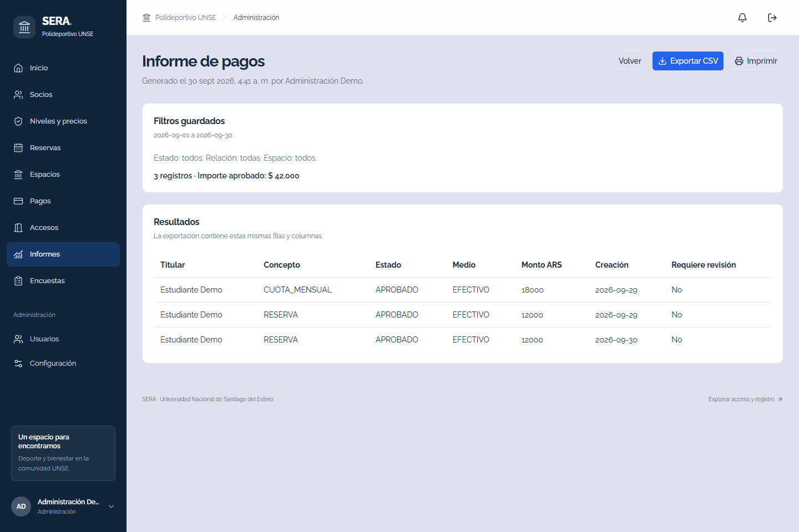

*Figura 21. Cada resultado conserva los filtros y los datos existentes al momento de generarlo.*

| Informe | Cómo interpretar el resultado |
| --- | --- |
| Socios | Usa la fecha de alta del socio para el período. Muestra relación UNSE, verificación y estado de membresía. |
| Reservas | Usa la fecha reservada para el período. Permite revisar espacio, titular, horario, personas y estado. |
| Pagos | Usa la fecha de creación del pago. El importe aprobado suma los registros aprobados incluidos en el resultado. |
| Utilización de espacios | Resume reservas, ingresos registrados, horas reservadas y personas por espacio. Las reservas pendientes o canceladas no representan asistencia. |

La utilización describe actividad registrada; no es un porcentaje de ocupación contra toda la capacidad horaria. Si necesitás comparar asistencia, revisá la cantidad de ingresos registrados además de las reservas. Para la definición precisa de cada columna y métrica, consultá [REPORTES_ENCUESTAS.md](REPORTES_ENCUESTAS.md).

### Exportar, imprimir y recuperar informes

- **Exportar CSV** descarga las mismas columnas y filas de la instantánea guardada. Podés abrir el archivo con una planilla de cálculo; si el programa pide el separador, elegí coma y codificación UTF-8.
- **Imprimir** abre la impresión del navegador. Si tu sistema ofrece guardar como PDF, podés seleccionarlo allí.
- **Informes recientes** permite recuperar resultados anteriores y avanzar por el historial.

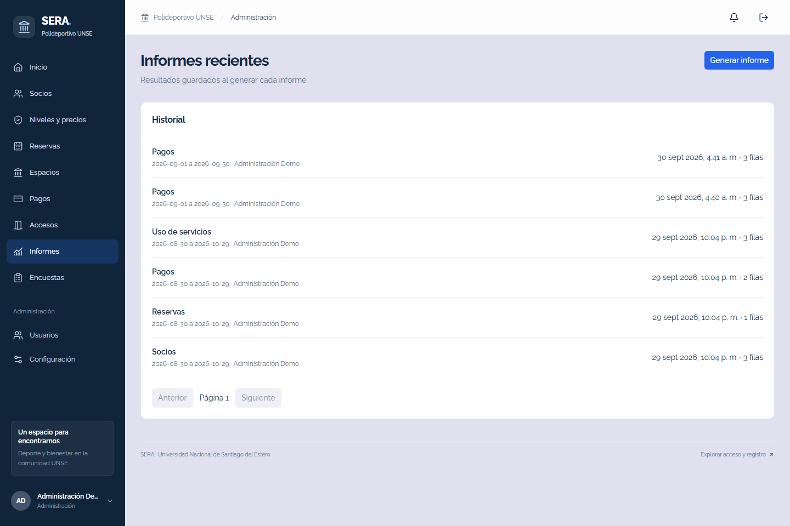

*Figura 22. Abrir un informe anterior recupera su instantánea; no actualiza sus datos con movimientos nuevos.*

Para obtener datos actuales, generá otro informe. Si el período devuelve demasiadas filas, reducí el rango o agregá filtros. El sistema admite hasta 5.000 filas por informe y avisa cuando se supera ese límite.

## 10. Administración de encuestas

### Publicar una encuesta

1. Abrí **Encuestas** desde administración.
2. Elegí **Nueva encuesta**.
3. Completá título, descripción y fechas **Disponible desde** y **Disponible hasta**.
4. Elegí el espacio de la encuesta, o todos los espacios.
5. Escribí las preguntas e indicá tipo y obligatoriedad. Para una pregunta de opciones, cargá las alternativas que pide el formulario.
6. Revisá la definición y elegí **Publicar encuesta**.

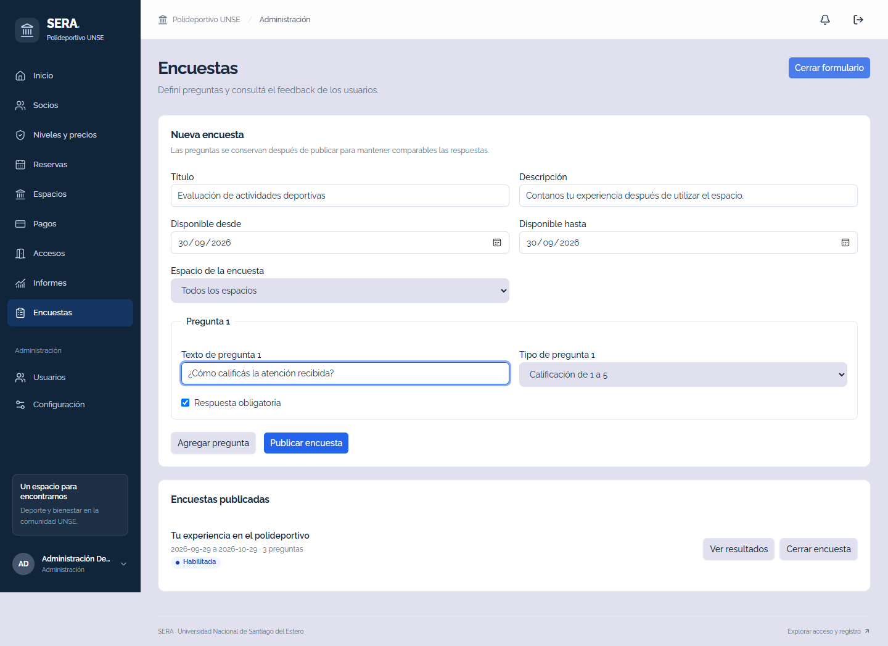

*Figura 23. La definición establece qué usuarios pueden responder según la reserva utilizada, el espacio y el período.*

Una vez publicada, las preguntas se conservan para mantener comparables las respuestas. Si necesitás cambiar la definición, publicá otra encuesta. **Cerrar encuesta** detiene nuevos envíos; **Habilitar encuesta** permite responder otra vez mientras el período siga vigente. Reabrirla no permite que una persona envíe por segunda vez para la misma reserva.

### Consultar resultados

Elegí **Ver resultados** en una encuesta. Revisá el total de respuestas, los promedios de calificaciones, las distribuciones por opción y el detalle de envíos. Cada envío muestra su titular y reserva asociada. Una pregunta opcional sin responder puede tener menos respuestas que el total de envíos.

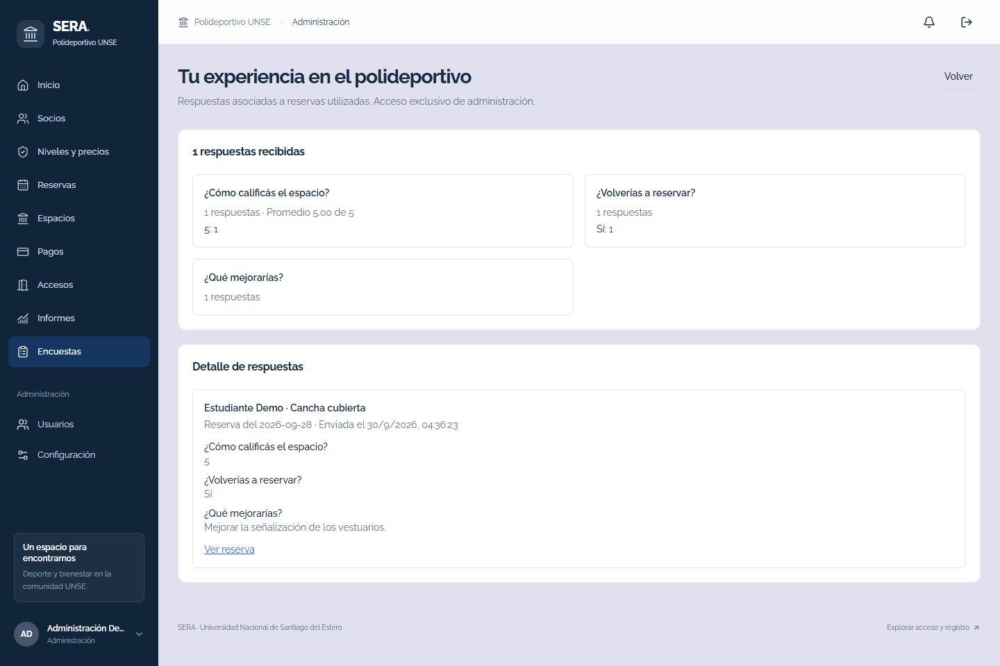

*Figura 24. Los resultados administrativos se calculan con las respuestas recibidas.*

## 11. Control de accesos

### Leer un carnet o una reserva

1. Ingresá con una cuenta de personal de accesos o administración.
2. Abrí **Accesos** si sos administrador, o **Validar ingreso** si sos personal de accesos.
3. Elegí **Activar cámara** y permití el acceso del navegador, o cargá una **Imagen del QR**.
4. También podés escribir el código en el campo de ingreso manual y validarlo.
5. Revisá el resultado que devuelve SERA antes de permitir el ingreso.

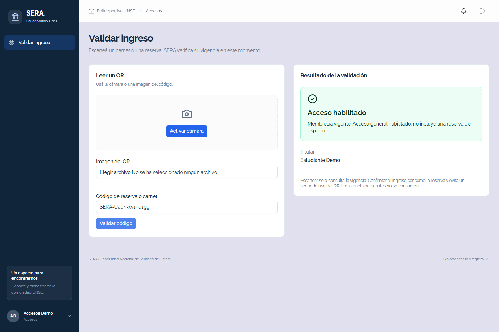

*Figura 25. Cámara, imagen y escritura del código consultan las mismas reglas de vigencia.*

La cámara necesita HTTPS o localhost y el permiso del navegador. Si no se abre, usá una imagen nítida o escribí el código. La carga de un código manual no permite omitir las validaciones.

### Interpretar y confirmar el resultado

Para un carnet, SERA comprueba que la cuenta y los beneficios de membresía estén vigentes. Para una reserva, comprueba pago, fecha, horario y que no tenga un ingreso ya registrado.

Si una reserva permite ingresar, elegí la acción de confirmación de ingreso que muestra el resultado. Validar el código consulta la situación; **confirmar el ingreso** registra el consumo de la reserva. Una segunda confirmación se rechaza y no duplica el ingreso.

Si el resultado rechaza el acceso, revisá el motivo: una reserva futura todavía no habilita el ingreso; una cancelada, vencida o consumida tampoco. En la versión actual no hay autorización excepcional con motivo ni historial completo de todos los intentos rechazados. El registro de ingreso a una reserva conserva fecha y responsable.

## 12. Problemas frecuentes

| Situación | Qué revisar o hacer |
| --- | --- |
| No puedo iniciar sesión. | Revisá email, contraseña y estado de la cuenta. Si no recordás la contraseña, pedí ayuda a administración. |
| El pago fue realizado, pero la membresía sigue pendiente. | Si es efectivo, pedí que administración confirme el cobro. Si es Mercado Pago, abrí Mi membresía y elegí Ya pagué, verificar pago. |
| Hay un pago aprobado, pero sigo sin beneficios. | Consultá si requiere revisión o pertenece a una contratación anterior. Revisá también el estado de cuenta, suspensión y próximo vencimiento. |
| Mercado Pago no vuelve automáticamente a SERA. | Regresá a Mi membresía y verificá el cobro. Para una reserva, abrí su detalle y la verificación del pago. |
| El checkout muestra un error de configuración. | La solicitud local puede haber quedado registrada. Consultá Mi membresía y contactá a administración para revisar la configuración antes de repetir. |
| No aparece Solicitar pago en efectivo. | Puede existir un pendiente, una suscripción de Mercado Pago, una cancelación o suspensión. Consultá Mi membresía; no dependas solo del filtro del historial. |
| La cancelación de membresía falla. | Si usa Mercado Pago, el proveedor debe confirmar la baja. Revisá el error y volvé a intentar cuando se resuelva; no des por cancelada una membresía que sigue activa o pendiente. |
| No puedo volver a contratar. | La contratación anterior debe estar Cancelada. Completá o cancelá la solicitud pendiente y comprobá que la cuenta esté activa. |
| No hay horarios disponibles. | Probá otra fecha o duración. El calendario descuenta reservas, bloqueos y horarios fuera de servicio. |
| Mi reserva se venció mientras pagaba. | Revisá el estado. Un cobro tardío queda para revisión y no recupera automáticamente el horario. Contactá a administración. |
| No aparece un ticket al cancelar. | El ticket requiere un importe abonado. Revisá el pago y que la cancelación haya ocurrido antes del inicio. |
| No aparecen encuestas. | Debe existir una encuesta vigente para el espacio y una reserva propia con ingreso registrado. Finalizar el horario no registra asistencia. |
| El informe anterior no refleja un pago nuevo. | Es una instantánea. Generá otro informe con los filtros deseados. |
| No veo una opción que tiene otra cuenta. | Revisá tu rol. Los usuarios no tienen acceso a informes, resultados de encuestas ni confirmación administrativa de efectivo. |

La sección **Configuración** conserva una vista previa cuyos cambios no se guardan. Usá las secciones específicas de niveles, espacios, usuarios y socios para las operaciones implementadas. Los avisos de la interfaz no constituyen un historial completo de eventos.

## 13. Recorrido de demostración

Después de cargar la demo con las instrucciones de la [guía de instalación](INSTALACION_SERA.docx), usá estas cuentas ficticias. La contraseña común es la elegida al cargar la demo; en la presentación local preparada es `SeraDemo2026!`.

| Cuenta | Rol |
| --- | --- |
| `socio@sera.local` | Usuario con membresía activa y reserva utilizada |
| `admin@sera.local` | Administración |
| `staff@sera.local` | Personal de accesos |

Un recorrido corto para la presentación:

1. Como usuario, abrir **Inicio → Ir a mi perfil** y mostrar **Mi carnet**, **Mi membresía** y los pagos aprobados.
2. Crear una reserva futura en efectivo. Mostrar que sigue pendiente y todavía no tiene QR de acceso.
3. Como administrador, confirmar ese efectivo. Como usuario, abrir nuevamente la reserva y mostrar su QR.
4. Cancelar la reserva antes de su inicio y mostrar el ticket disponible para otra reserva.
5. Como usuario, responder la encuesta de la reserva histórica utilizada que trae la demo.
6. Como administrador, consultar los resultados de esa encuesta, generar un informe y descargar el CSV.
7. Como personal, validar el carnet. Explicar que la reserva futura se rechaza antes de su horario y que un ingreso consumido no puede registrarse dos veces.

Para demostrar cancelación y nueva contratación de una membresía, usá una cuenta de prueba y seguí la sección 3. Ese recorrido retira los beneficios de la contratación anterior y requiere aprobar una cuota nueva. El reinicio de la demo se realiza desde la guía de instalación, fuera de la interfaz de usuario.
